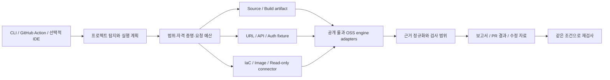

# Wakeio OSS 고도화 설계

> 현행 구현: 0.3 프리뷰에서 선택 Bandit, 제한된 Next/Supabase 규칙, 명시적 GET 권한 정책 및 보고서 비교를 추가했다. 이 문서는 그보다 넓은 목표 설계이며 현재 실행 범위는 [0.3 안내](preview-0.3.md)와 [체크리스트](checklist.md)를 기준으로 한다.

작성: 2026-09-15. 상태: 제품·기술 설계와 단계별 구현 계약. 아래 목표 기능을 현재 구현 완료로 해석하지 않는다. 현재 구현 범위는 `checklist.md`, 기존 v0.1 검증은 `verification.md`, 이번 변경의 검증은 `oss-next-verification.md`로 구분한다.

## 제품의 약속

목표: **개발자가 자기 코드·배포·테스트 계정을 연결해, 출시 전에 흔한 보안 실수를 찾고 수정 후 다시 확인하는 하나의 오픈소스 도구.**

사용자는 Next.js/React + Supabase, Node.js/Python 백엔드, API·권한 검증을 모두 필요로 한다. 세 영역을 같은 결과 형식과 실행 인터페이스로 제공한다. 요금제, 가입, Wakeio 클라우드 계정, 필수 AI 토큰으로 기능을 나누지 않는다. 정적·수동 검사에 없는 정보를 추측해서 동적 검증 완료로 표시하지 않는다.

채택 가설은 다음과 같다. 설치부터 첫 결과까지 짧고, 정상 코드를 과하게 경고하지 않으며, 개발자가 현재 가진 자료로 무엇을 확인할 수 있는지 설명하고, 같은 입력에서 재현할 수 있으면 반복 사용과 기여가 늘어날 수 있다. 이는 스타 수나 시장 수요가 검증됐다는 뜻이 아니다.

## 왜 별도 도구를 써야 하는가

이미 [Socket Basics](https://github.com/SocketDev/socket-basics)는 스캐너 실행·정규화·CI 연결을 제공하고, [SafeDep vet](https://github.com/safedep/vet)는 CLI·CI·공급망 검사를 제공한다. 따라서 도구 개수만으로 차별화했다고 주장하지 않는다.

Wakeio의 공개 결과에 다음 다섯 가지가 남아야 한다.

1. 프로젝트에서 발견한 기술·파일·API 범위와 수집하지 않은 범위.
2. 코드·공개 응답에서 관찰한 후보와 테스트 환경에서 재현한 결과의 구분.
3. 문제를 이해할 수 있는 입력→위험 동작의 근거, 원문 Secret을 뺀 위치와 검증 절차.
4. 수정 후 같은 조건을 다시 검사한 결과. 사라진 경고와 검사 자체가 빠진 상황을 구분.
5. 룰·엔진·취약점 데이터 버전, 필요한 입력, 실패·누락 원인.

## 사용자에게 노출할 형태

**공개 npm CLI + 동일 코어를 실행하는 GitHub Action을 기본 배포로 삼는다.** Docker 이미지는 Python/Java/브라우저/DAST 등 무거운 엔진이 필요한 실행에 추가한다. Codex/MCP·VS Code 등은 같은 코어를 호출하는 후속 인터페이스로 둔다.

| 배포 형태 | 역할 | 구현 상태 |
| --- | --- | --- |
| npm CLI | 로컬에서 첫 점검, CI 공통 실행, JSON 자동화 | 로컬 tarball 실행 구현. registry 공개 전 |
| GitHub Action | PR과 push에서 재검사, 결과 artifact | 로컬 composite Action 구현. 공개 ref 등록 전 |
| GitHub Release archive | 소스 확인·설치, checksum 검증 | 반복 가능한 로컬 패키징 구현. GitHub Release 공개 전 |
| OCI/Docker | 런타임이 다른 외부 엔진, API·브라우저 검사 격리 | 설계 단계 |
| GitLab·일반 CI | 같은 CLI와 종료 코드 재사용 | 예제 구현, 원격 GitLab 실행 미검증 |
| IDE/MCP | 발견 설명·수정 요청·재검사 호출 | 설계 단계. 핵심 검사에 필수 아님 |

현재 소스 폴더를 `vendor/`에 복사하는 사용법은 공개 등록 전 임시 방식이다. 공개 후 권장 경로는 검증된 npm 버전 또는 Action commit을 지정하는 것이다. 공개 패키지명과 저장소 owner/ref가 확정되기 전 실행 가능한 registry 명령을 만들어 광고하지 않는다.

목표 인터페이스 예시이며, 아래 새 명령·옵션은 아직 구현되지 않았다.

```text
wakeio-security-ci init
wakeio-security-ci scan
wakeio-security-ci scan --profile api --config wakeio.yml
wakeio-security-ci explain <finding-id>
wakeio-security-ci verify <finding-id>
```

`init`은 프레임워크·의존성·설정 후보를 읽어 검사 계획을 제안하고, 선택된 범위와 필요한 도구를 보여준다. API active scan이나 테스트 계정 사용을 일반 소스 스캔에 자동으로 섞지 않는다. `scan`은 필요한 엔진만 선택하고 버전·checksum을 검증해 준비한다. 큰 엔진을 받는 최초 실행 시간과 캐시 후 실행 시간을 별도로 표시한다.

v0.2.0-dev.1에 시작 표시와 종료 시 발견·미완료·보고서 위치 요약을 추가했다. 외부 실행 파일은 아직 별도 준비해야 하므로 첫 공개 preview에서는 엔진 설치 안내/자동 준비와 엔진별 진행 표시를 해결한다. registry에 올리기만 해서 첫 사용자 경험이 완성되는 것은 아니다.

## 입력이 늘어날 때 확인 수준이 어떻게 달라지는가

이 구분은 요금제가 아니라 **검증에 필요한 자료의 차이**다. 고정된 보안 점수나 서비스 전체 커버리지 백분율을 만들지 않는다.

| 제공 자료 | 목표 검사 | 판정할 수 있는 것 | 자동으로 알 수 없는 것 |
| --- | --- | --- | --- |
| 코드·lockfile | JS/TS·Python 정적 분석, Secret, 의존성, IaC, CI 설정 | 위험 동작 후보, 알려진 취약 버전, 선언된 잘못된 설정 | 실행 중 실제 권한·네트워크 상태 |
| 코드 + 기존 빌드 산출물 | 클라이언트 번들·서버 Secret 경계, 노출된 debug/source map 등 | 지정한 빌드 파일에 실제로 들어간 내용 | 배포 서버가 같은 파일을 제공하는지 |
| 배포 URL | 공개 응답·자원·정책·제한된 브라우저/DAST | 수집한 응답의 관찰, 허용한 테스트의 재현 | 로그인 뒤 업무 데이터와 비즈니스 규칙 |
| OpenAPI/GraphQL + 테스트 API | 입력 변형·스키마·오류·인증 요구 검증 | 지정 operation에서 발생한 계약 위반·오류·선별 취약점 | 소유권·조직 경계의 기대값 |
| 테스트 계정·리소스·권한 기대값 | 타 사용자/조직 접근, 역할, 철회, 결제 sandbox 시나리오 | 해당 행위·객체·상태에서 기대한 접근 통제가 작동하는지 | 모든 API와 모든 상태 전이의 완전성 |
| 읽기 전용 DB/클라우드 연결 | 실제 RLS·grant·정책·공개 리소스 상태 | 조회 시점 해당 연결 범위의 설정 | 계정 밖 리소스·전체 실시간 침입 탐지 |

최종 목표는 흔한 코드·의존성·설정 실수와, 사용자가 지정한 중요한 업무 흐름의 보안 회귀를 한 도구에서 확인하는 것이다. WAF·EDR·SIEM이나 범위가 정해지지 않은 침투 테스트·인증을 대체한다고 광고하지 않는다.

## 필수 검사 묶음과 구현 순서

아래 항목은 모두 OSS 범위다. 우선순위는 구현·검증 순서이며 특정 사용자층을 제외하는 의미가 아니다.

| 묶음 | 사용자에게 중요한 사례 | 실행 방식·엔진 | 먼저 통과해야 할 조건 |
| --- | --- | --- | --- |
| 코드 입력 흐름 | 중간 변수·구조 분해를 거치는 SQL/XSS/명령/SSRF/redirect | 현재 JS/TS 분석 개선 → 다언어 엔진과 자체 공개 룰 검토 | 위험/정상 쌍, 재대입·shadowing·scope 회귀, 알려진 미탐 공개 |
| Python | subprocess shell, SQL 구성, 위험 역직렬화, TLS 검증 해제, debug | Bandit adapter + framework 룰; 확장 시 Semgrep CE + 허용된 룰 | 실제 Python fixture와 native output, 무해한 인자 배열·정상 라이브러리 사용 구분 |
| Next/React | 클라이언트에 포함된 서버 Secret, 서버 권한 확인 없는 sensitive route 후보, 위험 HTML 렌더링 | import/build 경계 분석 + 자체 공개 룰 | 일반 public key·서버 전용 사용·정상 middleware 경로를 오탐하지 않음 |
| Supabase | secret/service-role의 공개 경로, RLS 미활성·과도한 정책, grant 조합 | 로컬 migration 분석과 실제 DB 메타데이터 조회를 별도 모드로 | publishable/anon 키를 Secret으로 단정하지 않음; SQL 이력만으로 live RLS 판정 금지 |
| Secret·공급망 | 현재 파일/선택한 Git 이력의 키, 취약 패키지, SBOM | Gitleaks·OSV 유지, 명시적 history mode, Trivy/SBOM | 원문 마스킹, fetch 범위 제한, 악성 패키지 여부와 CVE 여부 구분 |
| 배포·이미지·CI | 공개 debug, 위험 container 설정, image CVE, workflow 권한 | 기존 URL/Trivy 확장, workflow 룰, digest로 고정한 이미지 입력 | 이미지 검사에 Docker 소켓이 필수이지 않게 설계; live 설정과 IaC 구분 |
| API | 문서와 다른 응답, 잘못된 입력 수락, 5xx, 선별 injection 후보 | Schemathesis·ZAP adapter | staging·operation 허용 목록·요청/시간 예산·실행 중 취소·재현 기록 |
| 인증·인가 | A의 객체를 B가 읽기/수정, 조직 경계, 일반 사용자 admin 접근, 권한 철회 | 자체 policy matrix runner + 기존 HTTP 제어 | 허용 요청의 positive control과 금지 요청, fixture 객체 식별, session 유효성 검사 |
| 결제·업무 흐름 | 가격·수량 변경, webhook 인증, 중복 처리, 재시도 | 사용자 제공 sandbox·fixture·expected state | 실거래 금지, 변경 대상 명시, cleanup, baseline 및 사후 상태 확인 |
| 실제 연결 설정 | Supabase RLS/grants, 선택한 cloud resources | 읽기 전용 connector, 이후 CSPM engine | 최소 조회 권한, scope 기록, metadata만 기본 수집, 연결 미완료는 unknown |

Python의 기본 AST 검사는 [Bandit](https://bandit.readthedocs.io/en/latest/)를 우선 검토한다. [Semgrep 공식 라이선스](https://docs.semgrep.dev/licensing)는 CE 엔진과 Semgrep 관리 룰의 조건을 구분한다. CE 엔진 사용 가능성을 룰 재배포 권한으로 해석하지 않으며, 자체 작성 Apache-2.0 룰 또는 별도로 호환성을 확인한 룰만 묶는다.

[ZAP Automation Framework](https://www.zaproxy.org/docs/automate/automation-framework/)는 인증·OpenAPI·active/passive 작업을 조합할 수 있다. [Schemathesis](https://github.com/schemathesis/schemathesis)는 OpenAPI/GraphQL에서 입력과 workflow를 생성한다. 이들을 연결해도 서비스별 소유권·결제 규칙은 별도의 기대값이 필요하다.

[Supabase 공식 설명](https://supabase.com/docs/guides/getting-started/api-keys)은 공개 가능한 publishable/legacy anon 키와 secret/legacy service_role 키를 구분한다. [RLS 문서](https://supabase.com/docs/guides/database/postgres/row-level-security)처럼 grant와 policy를 함께 봐야 하므로, 키 패턴이나 policy 문자열 한 개만으로 사용자 데이터가 안전하다고 판단하지 않는다.

## 권한 테스트의 구체적 모델

예: `GET /orders/{id}`에 대한 비공개 주문 정책.

1. 테스트 사용자 A가 자기 fixture 주문을 정상적으로 조회한다. 응답에서 fixture marker와 소유자를 확인한다.
2. 로그인하지 않은 요청의 기대 결과를 확인한다.
3. 테스트 사용자 B가 같은 주문을 요청한다. 명세상 기대한 거부 또는 데이터 비노출 여부를 확인한다.
4. 다른 조직 사용자 C, 일반 사용자→관리자 기능 등의 행을 사용자가 선택한 범위에서 반복한다.
5. 정상 대조 요청이 실패하거나 로그인 상태가 불명확하면 테스트 성공이 아니라 미검증으로 남긴다.
6. 수정 후 같은 계정 역할·객체·정책·엔드포인트·허용 동작으로 재검사한다.

HTTP 200만 보고 유출이라고 판정하지 않는다. 서비스에 따라 404·빈 배열·필드 제거도 올바른 동작일 수 있으므로 expected policy와 민감 fixture marker를 함께 사용한다. 계정 두 개만으로 서비스의 모든 업무 정책을 알아냈다고 주장하지 않는다.

도구에는 bearer 값을 직접 저장하는 대신 환경변수 이름 또는 임시 credential reference를 전달한다. Authorization·쿠키는 다른 origin과 redirect에 전파하지 않는다. 쓰기 테스트는 격리된 테스트 데이터와 명시된 action을 요구하고, setup/cleanup 실패를 보고한다. 원본 고객 데이터는 결과 artifact의 기본 내용에 포함하지 않는다.

## 검사 결과와 수정 경험

목표 화면은 대량 경고 목록보다 다음 질문에 답해야 한다.

- 어디에서 무슨 문제가 발견되었는가?
- 코드 후보인가, 공개 응답 관찰인가, 테스트에서 재현했는가?
- 어떤 입력·대조 조건과 룰 버전이 근거인가?
- 어떻게 고치고 어떤 검사를 다시 실행하면 되는가?
- 어떤 중요한 검사는 아직 입력 부족·도구 오류·지원 부족 때문에 못 했는가?

동일 원인의 여러 엔진 결과는 관련 근거를 보존하며 묶는다. 안정적 finding ID와 baseline으로 새 문제·기존 문제·수정 확인·검사 누락을 구분한다. 기존 경고가 많아도 CI를 시작할 수 있게 하되 실행 오류를 baseline으로 숨기지 않는다. 예외는 규칙·대상·이유·기한을 남기고, 위험한 룰 전체 비활성화를 쉬운 기본값으로 만들지 않는다.

AI 편집기에 넘길 수정 자료에는 문제 설명·안전한 위치·수정 조건·재검사 명령을 담는다. AI 없이도 수정할 수 있는 설명이 기본이다. 자동 패치·외부 LLM 전송은 별도 명시적 기능으로 두며, Secret 삭제나 코드 문자열 제거만으로 실제 유효 키가 폐기됐다고 처리하지 않는다.

## 구조



`planner`는 사용자가 가진 입력으로 실행 가능한 범위를 반환한다. `runner`는 엔진 생명주기·격리·예산을 맡는다. `analyzer`는 findings와 coverage를 반환한다. `reporter`는 결과 표현을 맡는다. 각 engine의 오류·종료 코드는 adapter에서 통일한다. AI agent는 이 Interface를 호출할 수 있지만 결과의 진실성을 agent 문장에 의존하지 않는다.

## 공개 전에 필요한 증거

아래는 목표 기준이며 아직 달성한 수치가 아니다.

- 실제 배포 파일을 새 환경에 설치해 소스·URL·Python·API 예제를 각각 실행한다. 현재 지원하지 않는 모드는 성공으로 둔갑시키지 않는다.
- Next/Supabase, Node, Python, API·권한별 위험 버전/수정 버전 demo를 제공한다. demo는 테스트용이고 실제 키·결제·고객 데이터를 포함하지 않는다.
- 룰별 positive/negative와 지원하지 못한 경우를 공개한다. 합성 corpus 성능과 실제 프로젝트 성능을 분리한다.
- synthetic 테스트 통과 수를 탐지 정확도나 전체 보안 커버리지로 바꾸지 않는다. 미탐과 오탐을 둘 다 측정한다.
- cold install, cached quick scan, API deep scan의 실행 시간·다운로드 크기·runner 환경을 기록한다.
- 지원 대상별 외부 프로젝트에서 첫 실행·수정·재검사까지 완료한 사례를 확보한다. 별 수 대신 첫 검사 완료율, 오탐 제보, 재검사 재사용을 먼저 본다.
- 엔진 버전과 룰 버전·라이선스·업데이트 이력을 공개한다. 명시한 플랫폼에서 release archive를 검증한다.

English README를 기본 진입점으로 두고 한국어 사용법을 함께 추가했다. 현재 첫 화면에 입력별 지원표, 실제 구문 예시, 측정 결과, 데이터 처리 설명, 실행 명령과 알려진 한계를 둔다. 공개 전에는 실제 실행을 보여주는 30~60초 demo도 추가한다. 기여자가 룰 하나를 위험/수정 fixture 쌍과 함께 추가하는 방법을 제공한다. 기능·정확도 근거 없이 스타 증가를 보장하거나 커뮤니티에 무차별 홍보하지 않는다.

## 출시 순서

| 단계 | 납품할 결과 | 완료 판단 |
| --- | --- | --- |
| 현재 기반 개선 | JS/TS 데이터 흐름 보강, 공개 benchmark, 반복 가능한 패키징 | 회귀 테스트·독립 corpus·실제 archive 설치 검증 |
| 첫 공개 preview | CLI onboarding, Python adapter, Next/Supabase 룰, 영어 README·demo·플랫폼 CI | 세 개발 스택에서 소스 검사·수정·재검사 성공 |
| API preview | OpenAPI/GraphQL + 선별 ZAP/Schemathesis + 재현 자료 | 격리 demo의 위험/수정 API 구분, 예산·중지·오류 검증 |
| 권한 preview | 계정/조직/역할 policy matrix, read-only fixture 검사 | BOLA·역할·철회 positive/negative controls, 자격 증명 유출 없음 |
| 업무·연결 확장 | 결제 sandbox, 실제 RLS·cloud metadata, 이미지 | 테스트 상태·cleanup·읽기 권한과 coverage 검증 |

첫 공개 때는 각 모듈을 `stable / preview / planned`로 명시한다. 전부 필요하다는 요구를 버전별 개발 순서로 옮기되, 아직 구현하지 않은 API·Python·클라우드 기능을 오늘 배포한 것으로 표시하지 않는다.

## 배포의 신뢰

체크섬은 받은 파일의 무결성 확인이며 그 자체가 upstream의 침해 부재를 증명하지 않는다. 공개 배포에는 commit으로 고정한 Action, 최소 workflow 권한, 검토 가능한 lockfile, engine checksum·업데이트 절차를 사용한다. [GitHub의 Action 고정 안내](https://docs.github.com/en/actions/reference/security/secure-use)를 따른다.

npm 공개 시에는 [trusted publishing과 provenance](https://docs.npmjs.com/trusted-publishers/)를 우선 검토한다. 현재는 계정 연결·OIDC·공개 registry 등록이 없으므로 이를 구현된 신뢰 증명으로 표현하지 않는다. Release-check workflow와 실제 publish workflow도 분리한다.
